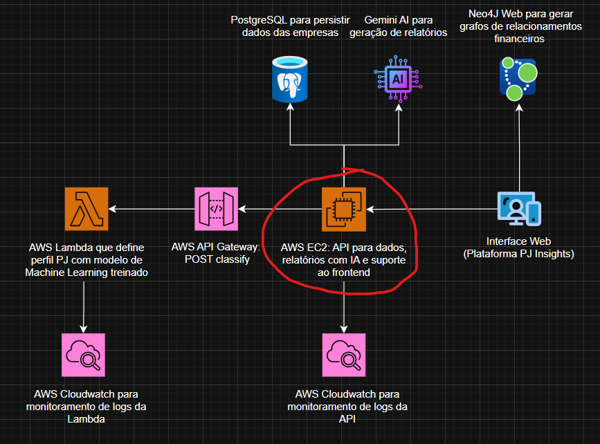

# PJInsights API

## Descrição do Projeto

API REST central da plataforma PJInsights, hospedada no AWS Elastic Beanstalk, responsável por analisar dados financeiros de pessoas jurídicas. Integra um modelo de Machine Learning não supervisionado, executado na função AWS Lambda [profileclassifier](https://github.com/vitxr10/pjinsights-profileclassifier-lambda), para classificar o momento de vida das empresas, e utiliza o Gemini AI para gerar relatórios inteligentes, insights e recomendações personalizadas para clientes PJ de instituições bancárias.
<br>


### Principais Funcionalidades
- Classificação automática do estágio da empresa através de modelo de machine learning treinado
- Análise preditiva e diagnóstico do perfil financeiro utilizando IA
- Recomendações personalizadas baseadas no estágio identificado (Início/Expansão/Maturidade/Declínio)
- Gerenciamento de transações financeiras com análise contextual
- Geração de relatórios e insights específicos para cada perfil empresarial
- Autenticação segura de usuários
- Gestão completa de empresas e endereços

## Arquitetura

O projeto foi desenvolvido seguindo os princípios da Clean Architecture, garantindo separação de responsabilidades e independência de frameworks. A estrutura está organizada nas seguintes camadas:

```
src/main/java/br/com/pjinsights/
├── api/                 # Controllers e configurações da API
├── application/        # Casos de uso e DTOs
├── domain/            # Entidades e regras de negócio
└── infrastructure/    # Implementações técnicas (BD, segurança, etc)
```

### Componentes Principais
- **API Layer**: Responsável pela exposição dos endpoints REST
- **Application Layer**: Implementa os casos de uso da aplicação
- **Domain Layer**: Contém as regras de negócio e entidades
- **Infrastructure Layer**: Gerencia aspectos técnicos como persistência e segurança

## Tecnologias Utilizadas

- **Backend**:
  - Java 17
  - Spring Boot
  - Spring Security
  - Spring Data JPA
  - Flyway (Migrations)
  - Swagger/OpenAPI

- **Cloud & Serviços**:
  - AWS Elastic Beanstalk
  - AWS Lambda
  - Google Cloud (Gemini AI)
  - NeonDB (PostgreSQL)

- **Ferramentas**:
  - Maven
  - JWT
  - Docker

## Integrações

### Gemini AI
A integração com o Gemini AI é utilizada para:
- Análise avançada de perfil financeiro
- Geração de insights personalizados
- Previsões e recomendações financeiras

### AWS Lambda (ProfileClassifier)
Uma função Lambda especializada que utiliza um modelo de machine learning treinado para:
- Classificar automaticamente o perfil da empresa em quatro estágios:
  - Início
  - Expansão
  - Maturidade
  - Declínio
- Analisar dados financeiros e métricas de negócio
- Gerar insights baseados no estágio atual da empresa
- Fornecer recomendações personalizadas baseadas no perfil identificado

## Autenticação

O sistema utiliza autenticação JWT (JSON Web Token) implementada com Spring Security:

1. O usuário faz login com suas credenciais
2. O sistema valida e gera um token JWT
3. As requisições subsequentes devem incluir o token no header:
```
Authorization: Bearer {seu_token_jwt}
```

## Persistência de Dados

### NeonDB (PostgreSQL)
- Banco de dados PostgreSQL serverless
- Alta disponibilidade e escalabilidade
- Backups automáticos

### Padrão Repository
- Implementação do padrão Repository para cada entidade
- Abstração da camada de persistência
- Facilidade de manutenção e testabilidade

## Deploy

O deploy é automatizado através de um pipeline CI/CD utilizando GitHub Actions e AWS Elastic Beanstalk. O processo é acionado automaticamente a cada push na branch main.

### Pipeline de Deploy

```yaml
name: Deploy Java to Elastic Beanstalk

on:
  push:
    branches:
      - main

jobs:
  build-and-deploy:
    runs-on: ubuntu-latest

    steps:
      - name: Checkout repository
        uses: actions/checkout@v4

      - name: Set up Java
        uses: actions/setup-java@v4
        with:
          java-version: '17'
          distribution: 'temurin'

      - name: Build with Maven
        run: mvn clean install -DskipTests

      - name: Deploy to Elastic Beanstalk
        uses: einaregilsson/beanstalk-deploy@v21
        with:
          aws_access_key: ${{ secrets.AWS_ACCESS_KEY_ID }}
          aws_secret_key: ${{ secrets.AWS_SECRET_ACCESS_KEY }}
          application_name: pjinsights-api
          environment_name: pjinsights-api-prod
          version_label: ${{ github.sha }}-${{ github.run_number }}
          region: ${{ secrets.AWS_REGION }}
          deployment_package: target/pjinsights-0.0.1-SNAPSHOT.jar
          existing_bucket_name: ${{ secrets.BUCKET_NAME }}
          use_existing_version_if_available: true
```

### Fluxo de Deploy

1. **Trigger**: Push na branch main inicia o workflow
2. **Build**:
   - Checkout do código
   - Configuração do Java 17
   - Build do projeto com Maven
   - Geração do arquivo JAR

3. **Deploy**:
   - Upload do JAR para o bucket S3 configurado
   - Deploy automático no ambiente de produção do Elastic Beanstalk
   - Versionamento automático usando SHA do commit e número da execução

### Monitoramento

- Acompanhamento do deploy através das Actions do GitHub
- Logs e métricas disponíveis no console da AWS
- Health check automático pelo Elastic Beanstalk

---
Desenvolvido com ❤️ pela equipe PJInsights
